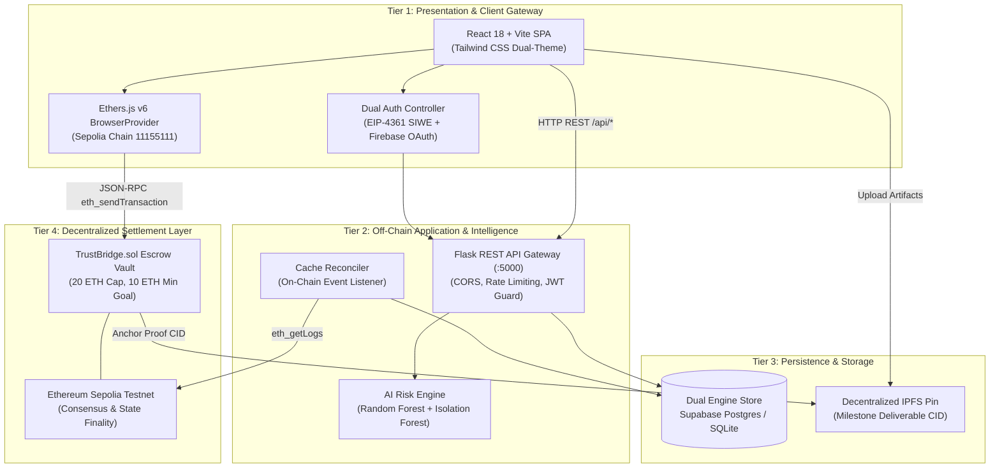
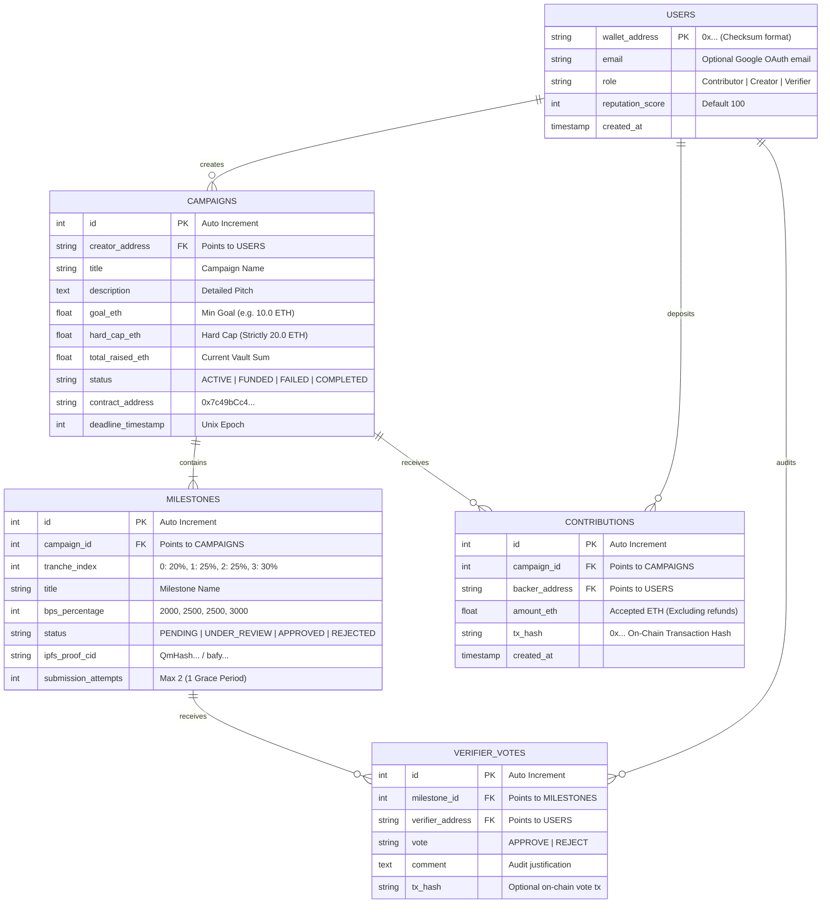
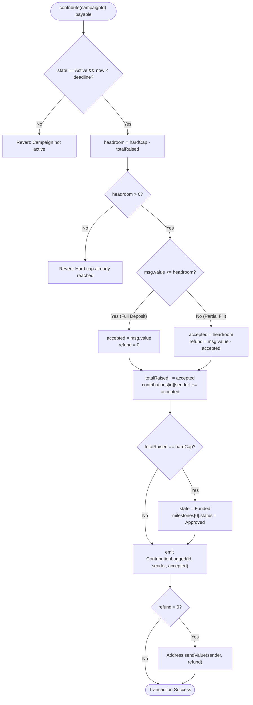
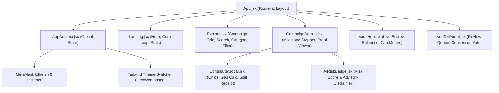

# TrustBridge: High-Level (HLD) & Low-Level (LLD) Design Specification

> **Document Type:** System Architecture & Detailed Engineering Specification  
> **Academic Target:** Senior Capstone / Faculty Viva Review  
> **Protocol Repo:** `d:/trustbridge`  
> **Smart Contract:** `TrustBridge.sol` on Sepolia (`0x7c49bCc4A869480Bf3BAd72acf826667066c58d2`)

---

## Table of Contents
1. [High-Level Design (HLD)](#1-high-level-design-hld)
   - 1.1 Context & Tiered Architecture Diagram
   - 1.2 Subsystem Responsibilities & Boundary Protocols
   - 1.3 External Integrations & Interfaces
   - 1.4 Non-Functional Requirements (NFRs)
2. [Low-Level Design (LLD)](#2-low-level-design-lld)
   - 2.1 Database Schema & Entity-Relationship Diagram (ERD)
   - 2.2 Smart Contract Architecture (`TrustBridge.sol`)
   - 2.3 Core Execution Algorithms & Flowcharts
   - 2.4 Frontend Component & State Machine Architecture
   - 2.5 Machine Learning & AI Risk Telemetry Engine
3. [Faculty Viva Defense Cheat Sheet (HLD vs LLD)](#3-faculty-viva-defense-cheat-sheet)

---

## 1. High-Level Design (HLD)

### 1.1 Context & Tiered Architecture Diagram

The system is structured as a **3-tier hybrid Web3 FinTech architecture** separating off-chain advisory intelligence from on-chain monetary settlement.



### 1.2 Subsystem Responsibilities

| Subsystem | Tech Stack | Core Responsibility | Security Boundary |
|---|---|---|---|
| **Presentation Layer** | React 18, Vite, Tailwind | User interface, state display, wallet integration, real-time gas calculations | Client-side only; zero access to private keys |
| **API Gateway** | Python Flask, Gunicorn | Campaign discovery, user profiles, SIWE nonce generation, JWT token issuance | Off-chain; rate-limited; strictly isolated from contract keys |
| **AI Risk Engine** | Scikit-learn, NumPy | Supervised risk scoring, unsupervised anomaly detection, evidence checklist | Advisory only; cannot lock, freeze, or alter on-chain vault state |
| **Persistence Store** | PostgreSQL (Supabase) / SQLite | Metadata, user reputation, cached transaction history | Read-replica sync; smart contract remains source of truth |
| **Escrow Vault** | Solidity 0.8.20, Hardhat | Hard cap invariant, sequential milestone release, pull-payment payouts | On-chain trustless; zero admin key backdoors; non-custodial |

### 1.3 External Integrations & Interfaces

1. **MetaMask / EVM Wallets:** Connects via `window.ethereum` utilizing Ethers.js v6 `BrowserProvider`.
2. **Sepolia Testnet RPC:** Alchemy / Infura Sepolia endpoint (`https://rpc.sepolia.org`) over JSON-RPC 2.0.
3. **Firebase Auth:** Google OAuth 2.0 Identity Provider issuing verified ID tokens.
4. **IPFS Gateway:** Content-addressed storage for campaign pitch decks, whitepapers, and milestone deliverables.

---

## 2. Low-Level Design (LLD)

### 2.1 Database Schema & Entity-Relationship Diagram (ERD)



---

### 2.2 Smart Contract Architecture (`TrustBridge.sol`)

#### Data Structures (Storage Layout)

```solidity
enum CampaignState { Active, Funded, Failed, Completed }
enum MilestoneStatus { Pending, UnderReview, Approved, Rejected }

struct Milestone {
    string title;
    uint256 bps;              // 2000, 2500, 2500, 3000 (Sum = 10,000)
    MilestoneStatus status;
    string evidenceCid;       // IPFS CID
    uint8 submissionAttempts; // Capped at 2
    bool withdrawn;           // Single-claim invariant
}

struct Campaign {
    address payable creator;
    uint256 goalAmount;       // 10.00 ETH minimum
    uint256 hardCap;          // 20.00 ETH maximum
    uint256 totalRaised;      // Current accepted balance
    uint256 deadline;         // Timestamp
    CampaignState state;
    uint8 currentMilestone;   // 0 .. 3
    Milestone[4] milestones;
}

// Global Storage
mapping(uint256 => Campaign) public campaigns;
mapping(uint256 => mapping(address => uint256)) public contributions;
mapping(address => uint256) public pendingWithdrawals; // Pull-payment pattern
```

#### Access Modifiers & Invariants

```solidity
modifier onlyCreator(uint256 _campaignId) {
    require(msg.sender == campaigns[_campaignId].creator, "Not creator");
    _;
}

modifier inState(uint256 _campaignId, CampaignState _expected) {
    require(campaigns[_campaignId].state == _expected, "Invalid state");
    _;
}

// OpenZeppelin ReentrancyGuard nonReentrant applied on all payable & withdrawal methods
```

---

### 2.3 Core Execution Algorithms

#### Algorithm 1: In-Block Hard Cap Overflow & Delta Refund



#### Algorithm 2: Reentrancy-Proof Pull Payment (CEI Pattern)

```solidity
function withdrawTranche(uint256 _campaignId, uint8 _milestoneIndex) 
    external 
    nonReentrant 
    onlyCreator(_campaignId) 
{
    Campaign storage c = campaigns[_campaignId];
    Milestone storage m = c.milestones[_milestoneIndex];

    // 1. CHECKS
    require(c.state == CampaignState.Funded, "Campaign not funded");
    require(m.status == MilestoneStatus.Approved, "Milestone not approved");
    require(!m.withdrawn, "Tranche already withdrawn");

    uint256 amount = (c.totalRaised * m.bps) / 10000;
    require(amount > 0, "Zero payout amount");

    // 2. EFFECTS (State mutations precede external transfer)
    m.withdrawn = true;
    if (_milestoneIndex == 3) {
        c.state = CampaignState.Completed;
    }

    // 3. INTERACTIONS (Low-level call protected by nonReentrant)
    Address.sendValue(c.creator, amount);

    emit TrancheWithdrawn(_campaignId, _milestoneIndex, amount);
}
```

---

### 2.4 Frontend Component & State Architecture



---

### 2.5 Machine Learning & AI Risk Telemetry Engine

The off-chain AI subsystem runs on `backend/ml/predictor.py` and implements a **dual-model pipeline**:

1. **Supervised Risk Classifier (Random Forest / Gradient Boosted):**
   - Inputs: Funding Goal ($x_1$), Milestone Duration ($x_2$), Creator Historical Velocity ($x_3$), Category Risk Weight ($x_4$).
   - Output: Expected probability of milestone delivery success ($P \in [0.0, 1.0]$).

2. **Unsupervised Anomaly Detector (Isolation Forest):**
   - Contamination parameter: $\alpha = 0.05$.
   - Goal: Flags campaigns with uncharacteristic parameter combinations (e.g. 20 ETH requested for a 3-day duration).
   - Anomaly Score: $s(x, n) = 2^{-\frac{E(h(x))}{c(n)}}$. If $s > 0.65$, triggers `ANOMALY_WARNING` badge.

3. **Mandatory Advisory Guardrail:**
   - Strict regulatory requirement enforced across API responses and UI modals:
   > *"This is an AI-generated advisory assessment and not a financial verdict."*

---

## 3. Faculty Viva Defense Cheat Sheet

| Question | Level | Academic Defense Response |
|---|---|---|
| **What is the difference between your HLD and LLD?** | Both | **HLD** defines the system boundaries, multi-tier deployment (React, Flask, Sepolia EVM), protocols (REST, JSON-RPC, IPFS), and NFRs. **LLD** defines the exact data structures (`Campaign`, `Milestone`), database ERD tables, CEI execution algorithms, and ML classification mathematics. |
| **Why is the 20 ETH hard cap implemented on-chain instead of off-chain in the API?** | LLD | An off-chain check can be bypassed by sending a transaction directly to the contract address via Etherscan or scripts. Enforcing the invariant on-chain ensures **immutable mathematically guaranteed execution** regardless of the client used. |
| **Why do you use Basis Points (BPS) for milestone splits?** | LLD | Solidity does not have native floating-point math. Using Basis Points (where $10,000\text{ BPS} = 100.00\%$) allows integer division without rounding errors: $\text{amount} = (\text{totalRaised} \times \text{BPS}) / 10,000$. |
| **How does your hybrid database sync with Ethereum?** | HLD | The smart contract is the canonical source of truth for funds. The Flask backend uses an asynchronous reconciler that queries `eth_getLogs` for `ContributionLogged` events and synchronizes the local Postgres/SQLite tables for rapid search and sorting. |
| **What is the Pull-Payment pattern and why did you choose it?** | LLD | In push payments, the contract executes `transfer()` to multiple recipients in a loop. If one recipient is a malicious contract that reverts on receive, the entire transaction fails, locking all funds. In pull payments, each party withdraws their own balance individually, isolating failures. |
