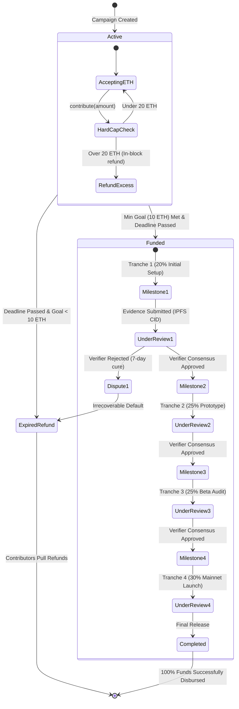
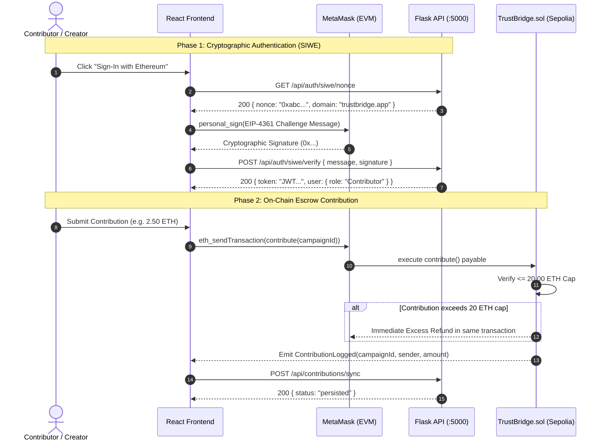
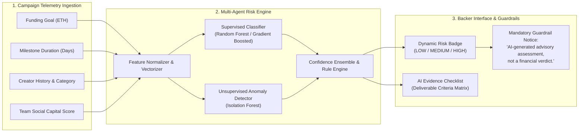

# TrustBridge: Protocol Architecture & Teacher Presentation Guide

> **Project Title:** TrustBridge — Decentralized Crowdfunding Protocol with AI Risk Telemetry & Programmable Milestone Escrow  
> **Target Network:** Ethereum Sepolia Testnet (`0x7c49bCc4A869480Bf3BAd72acf826667066c58d2`)  
> **Interactive Diagrams:**  
> - 🌐 **System Architecture:** [`trustbridge_architecture.html`](trustbridge_architecture.html)  
> - 🔄 **Escrow State Machine:** [`trustbridge_escrow_lifecycle.html`](trustbridge_escrow_lifecycle.html)  
> - 🔐 **Authentication & Contribution Sequence:** [`trustbridge_auth_sequence.html`](trustbridge_auth_sequence.html)

---

## 1. High-Level System Architecture

TrustBridge operates on a **hybrid Web3 FinTech architecture** that decouples off-chain data processing and risk intelligence from on-chain monetary settlement.

```mermaid
flowchart TB
    subgraph ClientTier["1. Client & Presentation Tier (React 18 + Vite)"]
        UI["Web3 Responsive Interface<br/>(Groww Light / Binance Dark)"]
        Provider["Ethers.js v6 BrowserProvider<br/>(MetaMask Sepolia Sync)"]
        AuthModal["Dual Authentication Modal<br/>(Firebase OAuth + SIWE EIP-4361)"]
    end

    subgraph BackendTier["2. Off-Chain Intelligence & Persistence (Flask REST :5000)"]
        Gateway["Flask REST Gateway<br/>(CORS, Rate Limiting, JWT Auth)"]
        AIRisk["Multi-Agent Risk Engine<br/>(Random Forest + Isolation Forest)"]
        DB[(Metadata Persistence<br/>Supabase PostgreSQL / SQLite)]
    end

    subgraph Web3Tier["3. On-Chain Settlement & Evidence Layer (Sepolia EVM + IPFS)"]
        Contract["TrustBridge.sol Escrow Vault<br/>(20 ETH Hard Cap / 10 ETH Min Goal)"]
        IPFS["Decentralized Storage (IPFS)<br/>(Milestone Deliverable CID)"]
    end

    UI --> Provider
    UI --> AuthModal
    UI --> Gateway
    Provider -->|contribute() / withdrawTranche()| Contract
    AuthModal -->|POST /api/auth/*| Gateway
    Gateway --> AIRisk
    Gateway --> DB
    Contract -->|Audit Trailing Hash| IPFS
    UI -->|Upload Deliverable Evidence| IPFS
```

---

## 2. Milestone Escrow State Machine (4-Tranche Lifecycle)

Unlike traditional crowdfunding (e.g., Kickstarter or GoFundMe) where creators receive 100% of the capital upfront with zero accountability, TrustBridge enforces **programmable milestone tranches** (20% → 25% → 25% → 30% = 10,000 BPS).



---

## 3. Cryptographic Authentication & Execution Sequence



---

## 4. Multi-Agent AI Risk Telemetry Pipeline



---

## 5. Teacher / Viva Oral Defense Cheat Sheet

| Question from Teacher | Grounded Academic Answer |
|---|---|
| **Q1: Why do you have a Python/Flask backend if your contract is on the blockchain?** | The smart contract handles the **immutable financial escrow** (non-custodial fund storage, hard-cap invariant, and release locks). The backend handles **heavy off-chain workloads** (ML risk classification, search indexing, and cached profile analytics) that would be computationally prohibitive or impossible to run on-chain due to EVM gas costs. |
| **Q2: How does the contract prevent the creator from running away with the funds?** | Funds are locked in the `TrustBridge.sol` contract and disbursed across **4 sequential tranches** (20%, 25%, 25%, 30%). The creator can only withdraw the next tranche after submitting deliverable proof (IPFS hash) and receiving multi-signature consensus approval from independent verifiers. |
| **Q3: What prevents reentrancy attacks during withdrawals and refunds?** | We adhere strictly to the **Checks-Effects-Interactions (CEI)** pattern and implement **pull-payment withdrawals** (`withdrawTranche` and `claimRefund`). State balances are zeroed *before* transferring ETH, and each function is protected by OpenZeppelin's `nonReentrant` mutex. |
| **Q4: How does your hard-cap logic protect contributors?** | The contract enforces a strict ceiling of **20.00 ETH**. If a contributor attempts to send an amount that pushes the total pool over 20 ETH, the contract accepts only the required delta to reach exactly 20 ETH and **automatically refunds the excess balance in the exact same transaction block**. |
| **Q5: How does Sign-In with Ethereum (SIWE) work?** | SIWE follows **EIP-4361**. The backend generates a cryptographically secure random `nonce` with a 5-minute TTL. The user signs the challenge message with their private key via MetaMask. The backend uses `ecrecover` to extract the signer's public address and matches it against the claimed address. No passwords exist. |
| **Q6: Why is the AI output labeled with an advisory disclaimer?** | Ethical AI and regulatory best practices prohibit autonomous algorithmic financial verdicts. Our AI engine is strictly an **advisory telemetry layer** that flags anomalous metrics and generates review checklists for human verifiers, upholding human-in-the-loop governance. |

---

## 6. Smart Contract Key Invariants (`TrustBridge.sol`)

- **Hard Cap:** `20.00 ETH` (with in-block automatic excess refund).
- **Minimum Goal:** `10.00 ETH` (refund unlocked if not achieved by deadline).
- **Milestone Distribution:**
  - Tranche 1: `2,000 BPS` (20.00%)
  - Tranche 2: `2,500 BPS` (25.00%)
  - Tranche 3: `2,500 BPS` (25.00%)
  - Tranche 4: `3,000 BPS` (30.00%)
  - **Total:** `10,000 BPS` (100.00%)
- **Withdrawal Mechanism:** Pull payment via `Address.sendValue(payable(msg.sender), amount)`.
